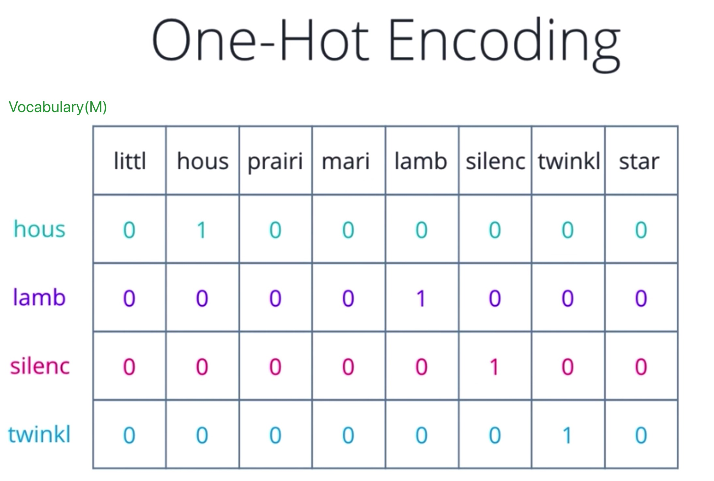
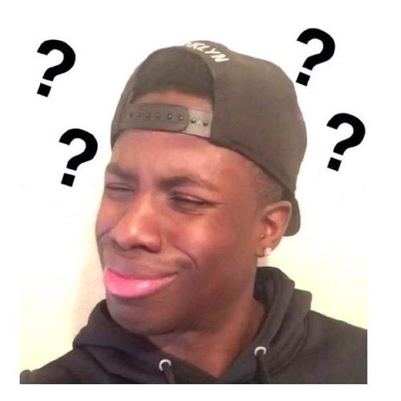
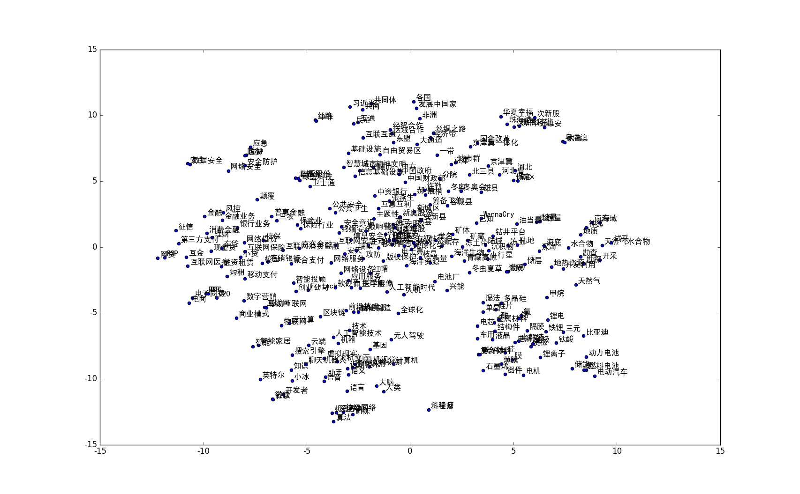

# Representation 学习笔记

>最近在学习Bert和Ernie，顺带的想回顾一下Representation的发展史，以当前的视角对之前的这些技术做些总结和思考。

Representation的实质是将文本转化为多种特征的描述，从而能从更多纬度、层次表达丰富、准确的含义。

## One-hot Encoding

有人叫独热编码（哑变量），但是感觉很奇怪，还是叫One-hot比较好。这是一种最早开始使用的字符级表示方法，想法非常的朴素和实用。
根据当前要使用的语料库，建立一个词典(Vocabulary)。对于要表示的语句，查找单个token在词典中的位置，如果是则当前位置置为1。
经过这样的转换，所有的文本，都可以转换成一个转换成一个1*M维的向量。

优点：解决了分类器不好处理分类数据的问题，在一定程度上也起到了扩充特征的作用。简单、易用。

缺点：丢失了文本间的序列信息，丢失文本出现次数信息，当类别的数量很多时，特征空间会变得非常大，容易造成维度灾难。

## Word Embedding
embedding是个神奇的东西，在刚开始学习的时候，真的是没有办法理解什么是embedding，词嵌入，纳尼！

为了能弄明白，还是看看它是怎么来的吧。

Word Embedding是个很久远的东西了，最早是由Bengio大神在2003年发表的NNLM网络结构中提到的，当时它只是个副产品。
这个模型的主要作用，就是后来大名鼎鼎的"神经网络语言模型"。这个模型虽然生的很早，但是被世人知道实在2013年了，
经历10年沉冤，最后得以昭雪（是不是很多伟大的著作都是这样），附上大神的论文[A Neural Probabilistic Language Model](http://www.jmlr.org/papers/volume3/bengio03a/bengio03a.pdf)，
有兴趣可以看看，这里就不过多介绍了。

模型长成上面这个样子，我们看到的C(W)就是Word Embedding的值，那么这个值是怎么来的呢？这个值是由任意单词W用one-hot编码后，
得到一个1 * M维的矩阵，乘以神经网络的权重矩阵Q得到的，这个Q是一个M * 1维的矩阵（Q的值是模型学习到的），
那么以后我们想要使用embedding的时候，就用one-hot乘以这个矩阵就可以了。

2013年就有人使用这种网络结构做了word embedding的工具，名叫Word2Vec（这个工具可能在今天还有人在用呢），这个工具使用的
网络和NNLM基本是一样的，唯一的不同是训练方法不同。Word2Vec有两种训练方法，一种叫CBOW，核心的思想是从一个句子里面把一个词扣掉，
用这个词的上下文，去预测这个被扣掉的词；第二种叫做Skip-gram，和CBOW正好反过来，输入某个单词，要求网络预测它的上下文单词。
而回头看看，NNLM是使用单词的上文去预测这个单词。那为什么Word2Vec要这么处理呢，这事因为任务目的的不同。NNLM的主要目的是用来做语言模型，
语言模型的任务就是从根据上文来预测下文，而word embedding只是一个副产品；但是Word2Vec的目标就是要word embedding，这是主产品。

那为什么要叫embedding这个'奇怪'的名字呢？这里有两个解释，第一个是因为实现方式，上文说的CBOW方法，是使用被扣掉词的上下文来预测被扣掉的词，
那这个被扣掉的词就好像被嵌入到上下文中间一样，所以起名embedding；还有一种解释是因为embedding是一个数学名词，
它表示的是一种结构化映射,具体可以参考wiki上的解释[embedding](https://en.wikipedia.org/wiki/Embedding)。我更倾向与第二种，
因为word embedding的这种方式，确实能在更高的纬度上给出一些词性、语意上的解释。例如下图中，我们可以看到，
很多词性、语意相近的词语会被聚类到一起。

那么有了这个embedding后，我们怎么用呢？这里我们要插入点图像领域'迁移学习(Transfer learning)'的知识了。有人可能会问这和图像领域有什么关系？
由于深度学习技术应用在图像领域要比应用到nlp领域早不少，所以有很多nlp领域的做法都是从图像领域借鉴而来的，我们nlp的预训练技术也是如此。

### 迁移学习
跟传统的机器学习算法相比，深度学习的劣势是什么？一个字，贵！在我们进行很多图像、声音的任务时，我们需要非常大的网络模型和超大规模的数据来进行训练，
为了训练好这样的模型，我们势必要消耗大量的时间和计算资源。那如果我们每次训练都要花费这么长的时间，深度学习技术的发展得是多么的缓慢。
所以在图像领域就有人就想出，可不可以借用之前训练过的模型，继续训练呢？答案当然是肯定的。

就像上图看到的，越是接近输入的层（低层），探测到的都是一些比较低级别的特征，比如说图像边缘的曲线、某种条纹等；而越是接近输出层，则识别到的都是更接近
任务最终目标的的图像，比如说上图的这个任务是给图片进行分类，那么最终层（高层）所探测到的这些特征就已经非常的接近完整的类别图像了，比如说狗、人、花等。
因为大部分的任务对于低级别的特征都是很相似的，就没有必要每次都重新训练了，我们直接拿过来大公司使用大型网络和数据训练出来的预训练模型，
直接用，又快，又好！

说到这里，就不得不继续说说该怎么用。大体上有两种方法。

首先使用预训练模型中的参数来初始化想要训练模型的低层参数，后面的参数重新随机初始化。

第一种，Frozen Transfer Learning
把使用预训练模型的初始化的低层参数冰冻(Freeze)上，然后使用数据训练后面随机初始化的网络参数。

第二种，Fine-tuning
不冰冻使用预训练模型的初始化的低层参数，使用数据训练整个网络的参数。

这里对于迁移学习的描述比较简单，如果对迁移学习感兴趣，可以去看看这篇论文[A Survey on Deep Transfer Learning](https://arxiv.org/pdf/1808.01974.pdf)
或者去读下这篇文章[A Comprehensive Hands-on Guide to Transfer Learning with Real-World Applications in Deep Learning](https://towardsdatascience.com/a-comprehensive-hands-on-guide-to-transfer-learning-with-real-world-applications-in-deep-learning-212bf3b2f27a).

介绍完迁移学习，我们继续nlp的话题。这么好的方法，当然有前辈给借鉴过来了，迁移学习的思路在nlp的任务上也同样适用。之前我们说到的embedding
矩阵Q，就是one-hot到embedding层的初始化参数。是不是很cool，这样我们就把word embedding用起来了。

优点：从one-hot encoding这种稀疏矩阵，转变成了一种稠密矩阵，降低了纬度。并且表示的向量能够在高维度中有很好的解释性。

缺点：word embedding是一个静态的编码模型，一个词不管出现在什么样的上下文中，它的编码结果都是不变的。这样在面对很多多义词时就表达的不准确了。
比如说'苹果'，在不同的上下文分别可以表示水果、公司、手机、电影、歌曲等；还有一点是word embedding是一个词级别的模型，对于像中文这种就会非常
依赖分词的准确性。

## ELMO

## GPT

## Bert

## Future

